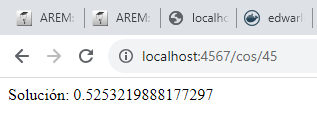
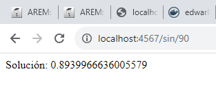
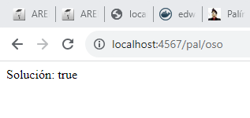
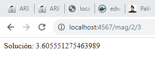

# Bono Parcial
**Estudiante:** Edwar Fabian Lozano Florez  
**Clase:** AREP  
**Profesor:** Luis Daniel Benavides

## Como funciona
1. Primero se debe clonar el repositorio
```
   https://github.com/EdwarLozano/BonoParcial.git
```
2. Luego se debe realizar el siguiente comando en la carpeta raíz
```
    mvn clean install
```
3. Después el siguiente comando
```
    java -cp "target/classes;target/dependency/*" co.edu.escuelaing.arep.SparkWebServer
```
4. Desde un navegador acceder a:
[web]: http://localhost:4567/hello
5. Para acceder a las funcionalidades:
- **Cos:**
```
    http://localhost:4567/cos/45
```

- **Sin:**
```
    http://localhost:4567/sin/90
```

- **Palíndromo:**
```
    http://localhost:4567/pal/oso
```

- **Magnitud:**
```
    http://localhost:4567/mag/2/3
```


**Nota:** Si se desea probar otro valor simplemente cambiandolo en el enlace  