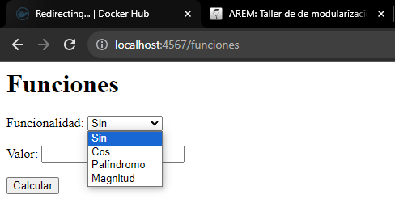
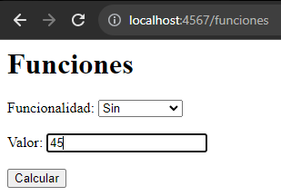
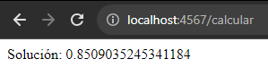
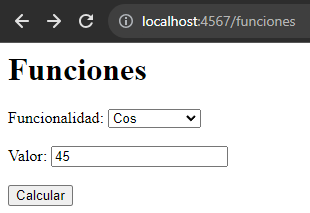
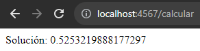
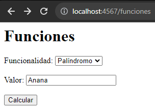
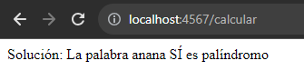
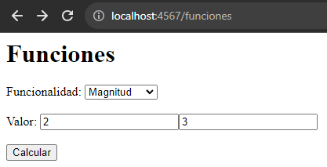
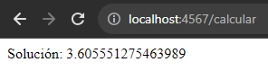

# Taller 5: TALLER DE DE MODULARIZACIÓN CON VIRTUALIZACIÓN E INTRODUCCIÓN A DOCKER
**Estudiante:** Edwar Fabian Lozano Florez  
**Clase:** AREP  
**Profesor:** Luis Daniel Benavides

## Como funciona
1. Primero se debe clonar el repositorio: https://github.com/EdwarLozano/Taller5-AREP.git
2. Luego se debe realizar el siguiente comando en la carpeta raíz
```
    mvn clean install
```
3. Se debe correr el método **Main** de la clase: src.main.java.co.edu.escuelaing.arep.**SparkWebServer.java**
4. Desde un navegador acceder a:
   http://localhost:4567/funciones
5. Para acceder a las funcionalidades simplemente se debe seleccionar la deseada e ingresar el o los valores solicitados

  

## Pruebas de funciones:

- **Sin:**

  

  
- **Cos:**

  

  

- **Palíndromo:**

  

  

  **Nota:** Como se evidencia en la imágen la función funciona sin importar las mayúsculas.

- **Magnitud:**

  
  
  

## Docker:


